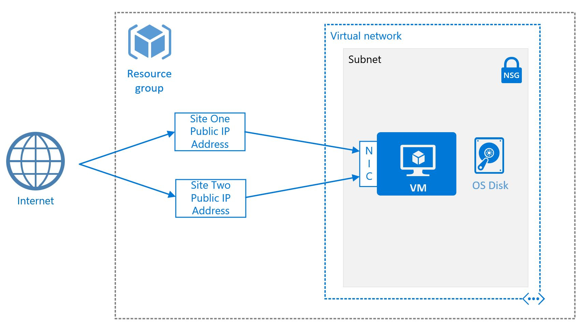
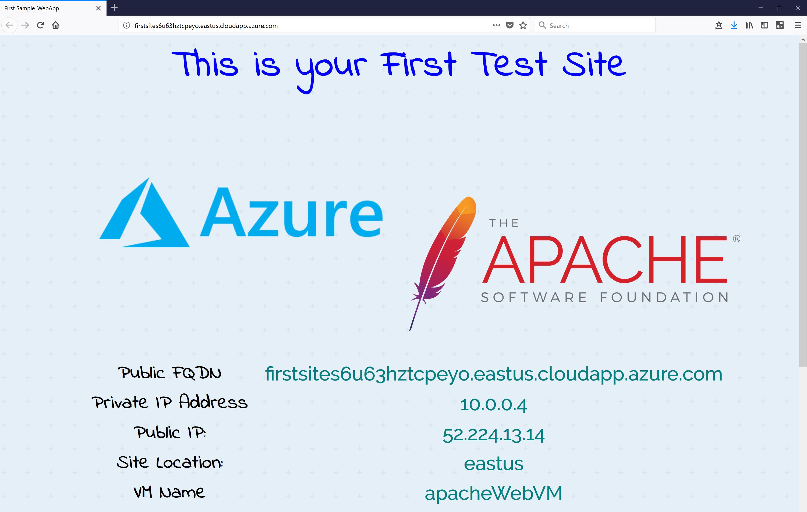
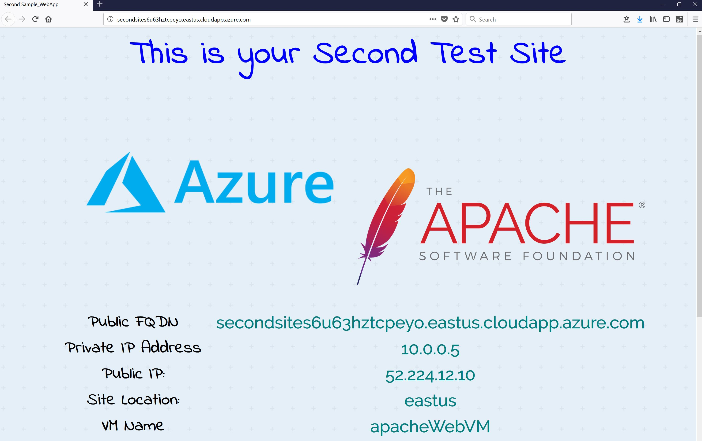
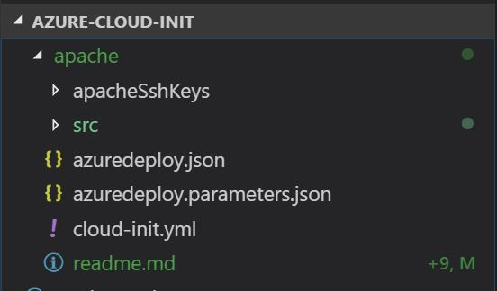

# Apache Two Site deployment on Azure
<p align="center">
    <a href="https://portal.azure.com/#create/Microsoft.Template/uri/https%3A%2F%2Fraw.githubusercontent.com%2Falihhussain%2Fazure-cloud-init%2Fmaster%2Fapache%2Fazuredeploy.json" target="_blank">
        
    </a>
    <a href="http://armviz.io/#/?load=https%3A%2F%2Fraw.githubusercontent.com%2Falihhussain%2Fazure-cloud-init%2Fmaster%2Fapache%2Fazuredeploy.json" target="_blank">
        
    </a>
</p>

This template deploys a set of Azure resources and configures the resources to server two Apache web pages.
<p align="center">
    
</p>

The Azure Resources deployed will be:
* Virtual Network
* Network Security Group
* Virtual Machine
* Network Interface Card
* 2 Public IP Addresses

Only certain Marketplace VM images support cloud-init. In this deployment **Ubuntu 16.04-LTS** is used. 

For the latest visit [documentation.](https://docs.microsoft.com/en-us/azure/virtual-machines/linux/using-cloud-init)

## Deploy Template

1. Create Resource Group 
```bash
export rgName="apacheCloud"
export rgLocation="eastus"

az group create -l $rgLocation -n $rgName
```
2. Get Template
```bash
wget https://raw.githubusercontent.com/alihhussain/azure-cloud-init/master/apache/azuredeploy.json
```
3. Deploy Template
```bash
export rgName="apacheCloud"

az group deployment create --name MasterDeployment --resource-group $rgName --template-file ./azuredeploy.json
```
4. Fetch the FQDN for the two Apache sites
```bash
export rgName="apacheCloud"

az group deployment show -n MasterDeployment -g $rgName --query properties.outputs.firstSite.value | awk -F '"' '{print $2}' && \
az group deployment show -n MasterDeployment -g $rgName --query properties.outputs.secondSite.value | awk -F '"' '{print $2}'
```

5. Verify the Sites are functional
<p align="center">
    
</p>

### Optional - SSH into the VM
1. Fetch the SSH Private Key

```bash
wget https://raw.githubusercontent.com/alihhussain/azure-cloud-init/master/apache/apacheSshKeys/id_rsa
```
2. Change Permissions on the downloaded private key
```bash
chmod 600 ./id_rsa
```
3. Fetch the login command from deployment
```bash
export rgName="apacheCloud"

az group deployment show -n MasterDeployment -g $rgName --query properties.outputs.sshCommand.value | awk -F '"' '{print $2}'
```
Sample Output:
```bash
ssh -i ./id_rsa apacheAdmin@firstsite<RandomUniqID>.eastus.cloudapp.azure.com
```
4. Log into the VM
```bash
ssh -i ./id_rsa apacheAdmin@firstsite<RandomUniqID>.eastus.cloudapp.azure.com

#Accept the warning by typing "yes"
The authenticity of host 'firstsites6u63hztcpeyo.eastus.cloudapp.azure.com (52.224.13.14)' can't be established.
ECDSA key fingerprint is 45:cf:b9:ad:c4:c5:dd:9b:f7:0c:ef:a4:e2:6f:a5:3b.
Are you sure you want to continue connecting (yes/no)? yes
```

## Delete the Deployment

Delete the resource group and the resources deployed within it
```bash
export rgName="apacheCloud"

#Delete Resource Group
az group delete -g $rgName -y --no-wait

# Delete the downloaded template and private key
rm -f ./id_rsa ./azuredeploy.json
```

# Detailed Walkthrough
In this section a detailed step by step walkthrough of the different aspects of the cloud-init deployment are going to be illustrated.

## Directory Structure



* **apacheSshKeys** - Directory where the private and public key for the deployment is stored
* **src** - Directory where source content for the web page is stored
* **azuredeploy.json** - Azure ARM Template
* **azuredeploy.parameters.json** - Azure ARM Template Parameter File
* **cloud-init.yml** - Source cloud-init file that is fed into the ARM template (base64 encoded) 

## Walk-Through - ARM Template (azuredeploy.json)
## Walk-Through - cloud-init.yml Walk-Through
## Walk-Through - Second IP Configuration (Inside of VM)
## Walk-Through - Apache Configuration
## Walk-Through - Runtime Configuration Values


# Appendix 
```bash
export rgName="apacheCloud" && \
export rgLocation="eastus" && \
az group create -l $rgLocation -n $rgName && \
az group deployment create --name MasterDeployment --resource-group $rgName --template-file ./apache/azuredeploy.json > /dev/null && \
az group deployment show -n MasterDeployment -g $rgName --query properties.outputs.firstSite.value | awk -F '"' '{print $2}' && \
az group deployment show -n MasterDeployment -g $rgName --query properties.outputs.secondSite.value | awk -F '"' '{print $2}' && \
az group deployment show -n MasterDeployment -g $rgName --query properties.outputs.sshCommand.value | awk -F '"' '{print $2}'

# Onces deployed run the following command to see the FQDN for the Web Page
az group deployment show -n MasterDeployment -g $rgName --query properties.outputs.firstSite.value | awk -F '"' '{print $2}' && \
    az group deployment show -n MasterDeployment -g $rgName --query properties.outputs.secondSite.value | awk -F '"' '{print $2}'
az group deployment show -n MasterDeployment -g $rgName --query properties.outputs.sshCommand.value | awk -F '"' '{print $2}'
az group deployment show -n MasterDeployment -g $rgName --query properties.parameters.userScript.value | awk -F '"' '{print $2}' | base64 --decode

# See Multiple IPs
curl -s -H Metadata:true "http://169.254.169.254/metadata/instance/network/interface/0/ipv4/ipAddress/0/publicIpAddress?api-version=2017-08-01&format=text"
curl -s -H Metadata:true "http://169.254.169.254/metadata/instance/network/interface/0/ipv4/ipAddress/1/publicIpAddress?api-version=2017-08-01&format=text"
# Once done delete via
az group delete -g $rgName -y --no-wait

cat /dev/null > /root/.ssh/known_hosts

https://www.digitalocean.com/community/tutorials/how-to-set-up-apache-virtual-hosts-on-ubuntu-16-04
```

```bash
cd /var/lib/cloud/instances
vim user-data.txt
cat /var/log/cloud-init.log | grep config-scripts-user
cat /var/log/boot.log

cat /var/www/html/index.html

# Apache2 config files
cd /etc/apache2

#Files to create
```

## File permission issue
Error Message
```bash
The authenticity of host 'firstsite<RandomCharacters>.eastus.cloudapp.azure.com (<RandomIP>)' can't be established.
ECDSA key fingerprint is SHA256:HO/V33FDHMi+j12r7mnu3GoovHJ79/l6HBbohsyP4tI.
Are you sure you want to continue connecting (yes/no)? yes
Warning: Permanently added 'firstsite<RandomCharacters>.eastus.cloudapp.azure.com,<RandomIP>' (ECDSA) to the list of known hosts.
@@@@@@@@@@@@@@@@@@@@@@@@@@@@@@@@@@@@@@@@@@@@@@@@@@@@@@@@@@@
@         WARNING: UNPROTECTED PRIVATE KEY FILE!          @
@@@@@@@@@@@@@@@@@@@@@@@@@@@@@@@@@@@@@@@@@@@@@@@@@@@@@@@@@@@
Permissions 0644 for './id_rsa' are too open.
It is required that your private key files are NOT accessible by others.
This private key will be ignored.
Load key "./id_rsa": bad permissions
Permission denied (publickey).
```
To correct this behavior 

```bash
chmod 400 ./apache/apacheSshKeys/id_rsa
```
