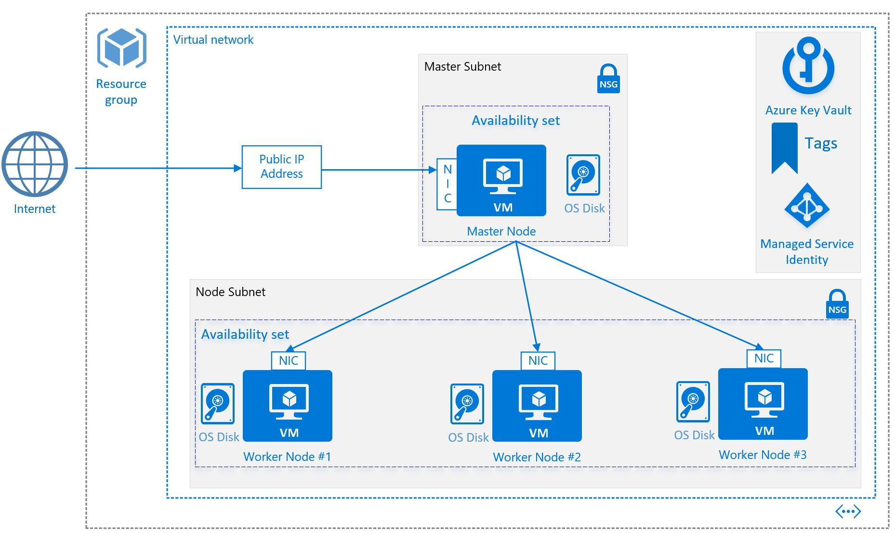

# Apache Two Site deployment on Azure
<p align="center">
    <a href="https://portal.azure.com/#create/Microsoft.Template/uri/https%3A%2F%2Fraw.githubusercontent.com%2Falihhussain%2Fazure-cloud-init%2Fmaster%2Fapache%2Fazuredeploy.json" target="_blank">
        
    </a>
    <a href="http://armviz.io/#/?load=https%3A%2F%2Fraw.githubusercontent.com%2Falihhussain%2Fazure-cloud-init%2Fmaster%2Fapache%2Fazuredeploy.json" target="_blank">
        
    </a>
</p>

This template deploys a set of Azure resources and configures the resources to serve two distinct Apache web pages.
<br><br>
**Documentation Sections**
- [Apache Two Site deployment on Azure](#apache-two-site-deployment-on-azure)
    - [Overview](#overview)
    - [Deploy Template](#deploy-template)
        - [SSH into the VM](#ssh-into-the-vm)
    - [Decode Cloud-Init Script that was used to bootstrap the VM](#decode-cloud-init-script-that-was-used-to-bootstrap-the-vm)
    - [Delete the Deployment](#delete-the-deployment)
- [Detailed Walkthrough](#detailed-walkthrough)
    - [Directory Structure](#directory-structure)
    - [Walk-Through - ARM Template (azuredeploy.json)](#walk-through---arm-template-azuredeployjson)
            - [Custom Data Schema](#custom-data-schema)
            - [Tags to Pass Runtime Values to VM](#tags-to-pass-runtime-values-to-vm)
    - [Walk-Through - cloud-init.yml Walk-Through](#walk-through---cloud-inityml-walk-through)
            - [Outputs Section ARM Template](#outputs-section-arm-template)
    - [Walk-Through - Second IP Configuration (Inside of VM)](#walk-through---second-ip-configuration-inside-of-vm)
    - [Walk-Through - Apache Configuration](#walk-through---apache-configuration)
    - [Walk-Through - Runtime Configuration Values](#walk-through---runtime-configuration-values)
- [Learnings](#learnings)
- [Appendix](#appendix)
    - [File permission issue](#file-permission-issue)

## Overview

<p align="center">
    
</p>


The Azure Resources deployed will be:
* Virtual Network
* Network Security Group
* Virtual Machine
* Network Interface Card
* 2 Public IP Addresses

Only certain Marketplace VM images support cloud-init. In this deployment **Ubuntu 16.04-LTS** is used. 

For the latest visit [documentation.](https://docs.microsoft.com/en-us/azure/virtual-machines/linux/using-cloud-init)

## Deploy Template

1. Create Resource Group 
```bash
export rgName="apacheCloud"
export rgLocation="eastus"

az group create -l $rgLocation -n $rgName
```
2. Get Template
```bash
wget https://raw.githubusercontent.com/alihhussain/azure-cloud-init/master/apache/azuredeploy.json
```
3. Deploy Template
```bash
export rgName="apacheCloud"

az group deployment create --name MasterDeployment --resource-group $rgName --template-file ./azuredeploy.json
```
4. Fetch the FQDN for the two Apache sites
```bash
export rgName="apacheCloud"

az group deployment show -n MasterDeployment -g $rgName --query properties.outputs.firstSite.value | awk -F '"' '{print $2}' && \
az group deployment show -n MasterDeployment -g $rgName --query properties.outputs.secondSite.value | awk -F '"' '{print $2}'
```

5. Verify the Sites are functional
<p align="center">
    
</p>

### SSH into the VM
1. Fetch the SSH Private Key

```bash
wget https://raw.githubusercontent.com/alihhussain/azure-cloud-init/master/apache/apacheSshKeys/id_rsa
```
2. Change Permissions on the downloaded private key
```bash
chmod 600 ./id_rsa
```
3. Fetch the login command from deployment
```bash
export rgName="apacheCloud"

az group deployment show -n MasterDeployment -g $rgName --query properties.outputs.sshCommand.value | awk -F '"' '{print $2}'
```
Sample Output:
```bash
ssh -i ./id_rsa apacheAdmin@firstsite<RandomUniqID>.eastus.cloudapp.azure.com
```
4. Log into the VM
```bash
ssh -i ./id_rsa apacheAdmin@firstsite<RandomUniqID>.eastus.cloudapp.azure.com

#Accept the warning by typing "yes"
The authenticity of host 'firstsites6u63hztcpeyo.eastus.cloudapp.azure.com (52.224.13.14)' can't be established.
ECDSA key fingerprint is 45:cf:b9:ad:c4:c5:dd:9b:f7:0c:ef:a4:e2:6f:a5:3b.
Are you sure you want to continue connecting (yes/no)? yes
```

## Decode Cloud-Init Script that was used to bootstrap the VM
1. Fetch the encoded message from deployment and decode it.
```bash
export rgName="apacheCloud"

az group deployment show -n MasterDeployment -g $rgName --query properties.parameters.userScript.value | awk -F '"' '{print $2}' | base64 --decode
```


## Delete the Deployment

Delete the resource group and the resources deployed within it
```bash
export rgName="apacheCloud"

#Delete Resource Group
az group delete -g $rgName -y --no-wait

# Delete the downloaded template and private key
rm -f ./id_rsa ./azuredeploy.json
```

# Detailed Walkthrough
In this section a detailed step by step walkthrough of the different aspects of the cloud-init deployment are going to be illustrated.

This template utilizes only the **cloud-init** functionality to run configurations, bootstrap the VM, and download appropriate runtime values such as Public IP address among others to setup two different Apache Websites. No VM extension resource is utilized to achieve this.

## Directory Structure


* **apacheSshKeys** - Directory where the private and public key for the deployment is stored
* **src** - Directory where source content for the web page is stored
* **azuredeploy.json** - Azure ARM Template
* **azuredeploy.parameters.json** - Azure ARM Template Parameter File
* **cloud-init.yml** - Source cloud-init file that is fed into the ARM template (base64 encoded) 

## Walk-Through - ARM Template (azuredeploy.json)
This template deploys out the following resources:

* 1st Azure Public IP - Default Value: ```PublicIP```
* 2nd Azure Public IP - Default Value: ```PublicIP2```
* Network Security Group - Default Value: ```defaultNsg```
* Virtual Network - Default Value: ```apacheVnet```
* Network Interface Card - Default Value: ```WebVMNic```
* Virtual Machine - Default Value: ```apacheWebVM```

**Note there is no extensions resource which typically would be there to bootstrap the VM.**

There are three sections of note in this template:
* [Additional customData schema for VM](#custom-data-schema)
* [Using Tags](#tags-to-pass-runtime-values-to-vm) to pass runtime values to VM that are not available via [Azure Instance Metadata Service](https://docs.microsoft.com/en-us/azure/virtual-machines/windows/instance-metadata-service) such as Public IP FQDN
* [Utilizing *outputs* section of the ARM template to spit out runtime values](#outputs-section-arm-template)

#### Custom Data Schema
This ```"customData": "[parameters('userScript')]"``` is added to the ```"Microsoft.Compute/virtualMachines"``` schema
```json
"osProfile": {
    "computerName": "[parameters('vmName')]",
    "adminUsername": "[parameters('adminUsername')]",
    "customData": "[parameters('userScript')]",
    "linuxConfiguration": {
        "disablePasswordAuthentication": true,
        "ssh": {
            "publicKeys": [
                {
                    "path": "[concat('/home/',parameters('adminUsername'),'/.ssh/authorized_keys')]",
                    "keyData": "[parameters('SSHKeys')]"
                }
            ]
        }
    }
}
```

```CustomData``` is populated with a cloud-init script that is base64 encoded.<br>
Once the ```cloud-init.yml``` file is created. Run ```base64 cloud-init.yml``` to encode it for use within the ARM template.

Example ```cloud-init.yml```
```bash
$ cat cloud-init.yml
#!/bin/bash
echo "Hello World"
```

Example base64 encoded ```cloud-init.yml```:
```bash
$ base64 cloud-init.yml
IyEvYmluL2Jhc2gKZWNobyAiSGVsbG8gV29ybGQiCg==
```

#### Tags to Pass Runtime Values to VM
There are certain resource values that cannot be predetermined and are not accessible via instance metadata service such as Public IP FQDN. <br>
To resolve this limitation these values are passed to the VM in this template via the Tags schema.
<br> <br>
In the following example the FQDN of both the public IP addresses is being concatenated and passed into the VM.

```json
{
    "apiVersion": "2017-03-30",
    "type": "Microsoft.Compute/virtualMachines",
    "name": "[parameters('vmName')]",
    "location": "[resourceGroup().location]",
    "tags": {
        "publicIP1": "[ concat(variables('dnsNameForPublicIP'), '.', resourceGroup().location, '.cloudapp.azure.com')]",
        "publicIP2": "[ concat(variables('dnsNameForPublicIP2'), '.', resourceGroup().location, '.cloudapp.azure.com')]"
    },
    "dependsOn": [
        "[concat('Microsoft.Network/networkInterfaces/', variables('nicName'))]"
    ],
    "properties": {
        "hardwareProfile": {
            "vmSize": "[variables('vmSize')]"
        }
    }
    ...
}
```
Example Tag on VM<br><br>
<p align="center"><p>
In the Cloud-Init section a detailed look on how to fetch the tags and utilize them is discussed.

## Walk-Through - cloud-init.yml Walk-Through
<p align="center">

</p>

#### Outputs Section ARM Template
There are 3 values of use that are needed to start consuming the Web Pages and the deployed VM.

* First Web Page FQDN
* Second Web Page FQDN
* Command to SSH into the deployed VM.

The ```outputs``` section within the ARM template is utilize to emit these values.<br>
Example ```outputs``` section:
```json
"outputs": {
    "firstSite": {
        "type": "string",
        "value": "[concat('http://', reference(concat('Microsoft.Network/publicIPAddresses/', variables('publicIPAddressName')), '2016-03-30').dnsSettings.fqdn)]"
    },"secondSite": {
        "type": "string",
        "value": "[concat('http://', reference(concat('Microsoft.Network/publicIPAddresses/', variables('publicIPAddressName2')), '2016-03-30').dnsSettings.fqdn)]"
    },
    "sshCommand": {
        "type": "string",
        "value": "[concat('ssh -i ./id_rsa ', parameters('adminUsername'), '@', reference(concat('Microsoft.Network/publicIPAddresses/', variables('publicIPAddressName')), '2016-03-30').dnsSettings.fqdn)]"
    }
}
```

To Fetch these values once the deployment as succeeded.

1. First Site FQDN
```bash
export rgName="apacheCloud"

az group deployment show -n MasterDeployment -g $rgName --query properties.outputs.firstSite.value
```

Example Output:
```bash
"http://firstsites6u63hztcpeyo.eastus.cloudapp.azure.com"
```

2. Second Site FQDN
```bash
export rgName="apacheCloud"

az group deployment show -n MasterDeployment -g $rgName --query properties.outputs.secondSite.value
```
Example Output:
```bash
"http://secondsites6u63hztcpeyo.eastus.cloudapp.azure.com"
```
3. SSH Command to log into the deployed VM
```bash
export rgName="apacheCloud"

az group deployment show -n MasterDeployment -g $rgName --query properties.outputs.sshCommand.value | awk -F '"' '{print $2}'
```
Example Output:
```bash
ssh -i ./id_rsa apacheAdmin@firstsites6u63hztcpeyo.eastus.cloudapp.azure.com
```

## Walk-Through - Second IP Configuration (Inside of VM)
## Walk-Through - Apache Configuration
## Walk-Through - Runtime Configuration Values

# Learnings
This section will list out a few points of note:
* If both cloud-init and custom extensions are utilized within the same template. The order of execution is as follows:
    1. Custom Extension executes first within the VM at runtime
    2. CustomData (Cloud-init) executes second within the VM at runtime


# Appendix 
```bash
export rgName="apacheCloud" && \
export rgLocation="eastus" && \
az group create -l $rgLocation -n $rgName && \
az group deployment create --name MasterDeployment --resource-group $rgName --template-file ./azuredeploy.json > /dev/null && \
az group deployment show -n MasterDeployment -g $rgName --query properties.outputs.firstSite.value | awk -F '"' '{print $2}' && \
az group deployment show -n MasterDeployment -g $rgName --query properties.outputs.secondSite.value | awk -F '"' '{print $2}' && \
az group deployment show -n MasterDeployment -g $rgName --query properties.outputs.sshCommand.value | awk -F '"' '{print $2}'

# Onces deployed run the following command to see the FQDN for the Web Page
az group deployment show -n MasterDeployment -g $rgName --query properties.outputs.firstSite.value | awk -F '"' '{print $2}' && \
    az group deployment show -n MasterDeployment -g $rgName --query properties.outputs.secondSite.value | awk -F '"' '{print $2}'
az group deployment show -n MasterDeployment -g $rgName --query properties.outputs.sshCommand.value | awk -F '"' '{print $2}'
az group deployment show -n MasterDeployment -g $rgName --query properties.parameters.userScript.value | awk -F '"' '{print $2}' | base64 --decode

# See Multiple IPs
curl -s -H Metadata:true "http://169.254.169.254/metadata/instance/network/interface/0/ipv4/ipAddress/0/publicIpAddress?api-version=2017-08-01&format=text"
curl -s -H Metadata:true "http://169.254.169.254/metadata/instance/network/interface/0/ipv4/ipAddress/1/publicIpAddress?api-version=2017-08-01&format=text"
# Once done delete via
az group delete -g $rgName -y --no-wait

cat /dev/null > /root/.ssh/known_hosts

https://www.digitalocean.com/community/tutorials/how-to-set-up-apache-virtual-hosts-on-ubuntu-16-04
```

```bash
cd /var/lib/cloud/instances
vim user-data.txt
cat /var/log/cloud-init.log | grep config-scripts-user
cat /var/log/boot.log

cat /var/www/html/index.html

# Apache2 config files
cd /etc/apache2

#Files to create
```

## File permission issue
Error Message
```bash
The authenticity of host 'firstsite<RandomCharacters>.eastus.cloudapp.azure.com (<RandomIP>)' can't be established.
ECDSA key fingerprint is SHA256:HO/V33FDHMi+j12r7mnu3GoovHJ79/l6HBbohsyP4tI.
Are you sure you want to continue connecting (yes/no)? yes
Warning: Permanently added 'firstsite<RandomCharacters>.eastus.cloudapp.azure.com,<RandomIP>' (ECDSA) to the list of known hosts.
@@@@@@@@@@@@@@@@@@@@@@@@@@@@@@@@@@@@@@@@@@@@@@@@@@@@@@@@@@@
@         WARNING: UNPROTECTED PRIVATE KEY FILE!          @
@@@@@@@@@@@@@@@@@@@@@@@@@@@@@@@@@@@@@@@@@@@@@@@@@@@@@@@@@@@
Permissions 0644 for './id_rsa' are too open.
It is required that your private key files are NOT accessible by others.
This private key will be ignored.
Load key "./id_rsa": bad permissions
Permission denied (publickey).
```
To correct this behavior 

```bash
chmod 400 ./apache/apacheSshKeys/id_rsa
```
